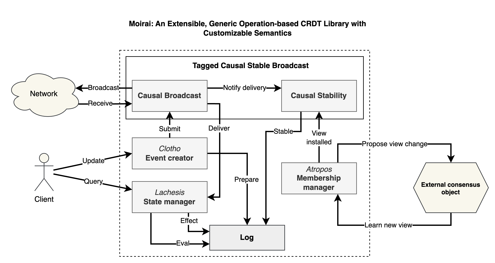

# Moirai: An Extensible, Generic Operation-based CRDT Framework with Customizable Conflict Resolution

**Moirai** is a Rust-based framework designed for building operation-based Conflict-free Replicated Data Types (CRDTs). It provides a flexible architecture that allows developers to implement custom conflict resolution policies, making it suitable for various distributed applications such as collaborative modeling.

## ⚠️ Work in Progress — In Development ⚠️

_This project is currently under active development. The API and features are subject to change as we refine the framework._

## Architecture

## Publications

The library has been used in the following research publications:

- Léo Olivier, Kirollos Morcos, Marcos Didonet del Fabro, Sebastien Gerard. [A Local-First Collaborative Modeling Approach with Replicated Data Types](https://cea.hal.science/cea-05322894). _CoPaMo'25 - International Workshop on Collaborative and Participatory Modeling, Oct 2025, Grand Rapids, United States._ ⟨cea-05322894⟩
